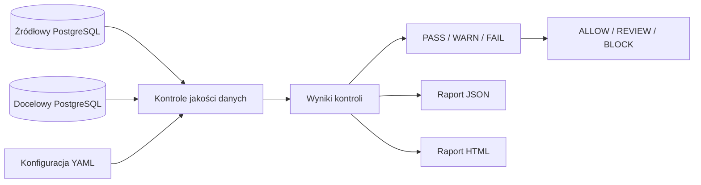

# Data Migration Quality Gate

Data Migration Quality Gate to narzędzie CLI pełniące rolę bramki jakości migracji, czyli `quality gate`, dla migracji danych pomiędzy dwiema bazami PostgreSQL. Porównuje bazę źródłową z bazą docelową, wykonuje zestaw kontroli jakości i zwraca decyzję wdrożeniową: `ALLOW`, `REVIEW` albo `BLOCK`.

Projekt jest aktualnie lokalnym release candidate wersji `0.1.0`. Implementuje działający pionowy fragment: walidację konfiguracji YAML, połączenie z dwiema bazami PostgreSQL, jedenaście typów kontroli jakości, czytelne podsumowanie CLI, raport JSON, samodzielny raport HTML, pakiet Python oraz uruchamianie przez hosta albo kontener CLI.

## Spis treści

- [Problem biznesowy](#problem-biznesowy)
- [Dla kogo jest to narzędzie](#dla-kogo-jest-to-narzędzie)
- [Jak działa narzędzie](#jak-działa-narzędzie)
- [Diagram przepływu](#diagram-przepływu)
- [Aktualny zakres](#aktualny-zakres)
- [Dostępne kontrole](#dostępne-kontrole)
- [Dane demonstracyjne](#dane-demonstracyjne)
- [Kontrolowane błędy target](#kontrolowane-błędy-target)
- [Wymagania](#wymagania)
- [Uruchomienie baz](#uruchomienie-baz)
- [Instalacja](#instalacja)
- [Build pakietu](#build-pakietu)
- [Docker Compose runner](#docker-compose-runner)
- [Konfiguracja YAML](#konfiguracja-yaml)
- [Walidacja konfiguracji](#walidacja-konfiguracji)
- [Uruchomienie gate](#uruchomienie-gate)
- [Statusy decyzje i kody wyjścia](#statusy-decyzje-i-kody-wyjścia)
- [Raport JSON](#raport-json)
- [Raport HTML](#raport-html)
- [Testy i quality gates](#testy-i-quality-gates)
- [Struktura projektu](#struktura-projektu)
- [Ograniczenia wersji 0.1.0](#ograniczenia-wersji-010)
- [Planowane kolejne kroki](#planowane-kolejne-kroki)

---

## Problem biznesowy

Migracja danych rzadko kończy się na prostym skopiowaniu rekordów. Zespół musi wiedzieć, czy dane w bazie docelowej są kompletne, czy nie pojawiły się nadmiarowe rekordy, czy logiczne klucze migracyjne nie zostały zdublowane oraz czy wartości w rekordach odpowiadają temu, co było w source.

Sama liczba rekordów nie wystarcza. Tabela docelowa może mieć tyle samo wierszy co tabela źródłowa, a mimo to zawierać inne rekordy, zmienione kwoty, skrócone opisy, przesunięte znaczniki czasu albo wartości spoza reguł domenowych.

Data Migration Quality Gate automatyzuje te kontrole i zwraca wynik, który można wykorzystać przed decyzją o wdrożeniu migracji.

[↑ Powrót do spisu treści](#spis-treści)

---

## Dla kogo jest to narzędzie

Projekt jest przeznaczony dla osób pracujących z migracjami danych i walidacją jakości danych:

- inżynierów danych,
- developerów odpowiedzialnych za migracje,
- analityków QA,
- release managerów,
- zespołów utrzymujących systemy z bazami PostgreSQL.

README zakłada znajomość podstaw SQL, migracji danych lub inżynierii danych. Nie wymaga znajomości wewnętrznej struktury tego repozytorium.

[↑ Powrót do spisu treści](#spis-treści)

---

## Jak działa narzędzie

Narzędzie czyta `migration.yaml`, waliduje konfigurację przez Pydantic, pobiera connection stringi ze zmiennych środowiskowych i wykonuje skonfigurowane kontrole dla tabel `customers`, `accounts` oraz `transactions`.

Baza źródłowa reprezentuje dane przed migracją. Baza docelowa reprezentuje wynik migracji. Obie bazy są uruchamiane lokalnie przez Docker Compose jako oddzielne usługi:

- `source-db`, baza `source_db`, port hosta `5433`,
- `target-db`, baza `target_db`, port hosta `5434`.

Każda tabela ma techniczny klucz `row_id`. Kontrole migracyjne używają natomiast logicznych kluczy domenowych skonfigurowanych w YAML, takich jak `customer_id`, `account_id` i `transaction_id`.

[↑ Powrót do spisu treści](#spis-treści)

---

## Diagram przepływu



[↑ Powrót do spisu treści](#spis-treści)

---

## Aktualny zakres

Wersja `0.1.0` obejmuje:

- CLI `data-quality-gate`,
- walidację konfiguracji YAML,
- połączenie z dwiema bazami PostgreSQL,
- jedenaście typów kontroli jakości danych,
- porównywanie wartości kolumn między source i target,
- tolerancję liczbową opartą o `Decimal`, bez użycia `float`,
- checksum dla deterministycznego porównywania całych zestawów kolumn,
- agregację wyników do `PASS`, `WARN` albo `FAIL`,
- decyzję wdrożeniową `ALLOW`, `REVIEW` albo `BLOCK`,
- raport JSON w katalogu `reports/`,
- samodzielny raport HTML w katalogu `reports/`,
- instalowalny pakiet Python,
- Dockerfile aplikacji CLI,
- opcjonalny runner `quality-gate` w Docker Compose,
- testy jednostkowe i integracyjne,
- lokalne środowisko demonstracyjne w Docker Compose.

Wersja aplikacji to `0.1.0`. Wersja schematu raportu JSON pozostaje `0.1`.

[↑ Powrót do spisu treści](#spis-treści)

---

## Dostępne kontrole

### `row_count`

Porównuje liczbę rekordów w tabeli źródłowej i docelowej. Zwraca `PASS`, gdy liczby są równe, oraz `FAIL`, gdy są różne.

### `missing_keys`

Wykrywa logiczne klucze obecne w bazie źródłowej, ale nieobecne w bazie docelowej. Zwraca `PASS`, gdy niczego nie brakuje, oraz `FAIL`, gdy co najmniej jeden klucz źródłowy nie występuje w target.

### `unexpected_keys`

Wykrywa logiczne klucze obecne tylko w bazie docelowej. Zwraca `PASS`, gdy takich rekordów nie ma, oraz `WARN`, gdy występują.

### `duplicate_keys`

Wykrywa duplikaty logicznych kluczy migracyjnych osobno w source i target. Zwraca `PASS`, gdy nie ma duplikatów, oraz `FAIL`, gdy duplikaty występują w którejkolwiek bazie.

### `schema_match`

Porównuje strukturę tabeli source i target. Sprawdza obecność kolumn, typ danych, długość pól znakowych, precision i scale dla `NUMERIC` oraz nullability. Nie porównuje nazw constraintów, indeksów, kolejności fizycznej kolumn ani wartości domyślnych.

### `null_check`

Sprawdza kolumny oznaczone w YAML jako `not_null: true`. Kontrola działa osobno dla source i target. Zwraca `PASS`, gdy nie ma niedozwolonych wartości `NULL`, oraz `FAIL`, gdy takie wartości występują.

### `allowed_values`

Sprawdza kolumny z listą `allowed_values`. Porównanie jest dokładne i case-sensitive. `NULL` nie jest naruszeniem tej kontroli, bo obsługuje go `null_check`.

### `referential_integrity`

Sprawdza logiczną integralność referencyjną wewnątrz tej samej bazy. Dla relacji skonfigurowanych przez `references` kontrola sprawdza, czy wartość w tabeli child istnieje w tabeli parent.

### `column_comparison`

Porównuje dokładne wartości kolumn oznaczonych jako `compare: true`, które nie mają skonfigurowanej tolerancji liczbowej. Porównanie obejmuje tylko rekordy porównywalne: klucz logiczny musi istnieć dokładnie raz w source i dokładnie raz w target. Klucze brakujące, nadmiarowe oraz zduplikowane są raportowane jako pominięte w komunikacie tej kontroli, a ich właściwe wykrywanie pozostaje odpowiedzialnością `missing_keys`, `unexpected_keys` i `duplicate_keys`.

Wartości `NULL` są równe tylko wtedy, gdy obie strony mają `NULL`. Porównanie tekstów jest dokładne i case-sensitive.

### `numeric_tolerance`

Porównuje wartości liczbowe kolumn z `compare: true` i `tolerance`. Kontrola używa typu `Decimal`, dzięki czemu unika błędów zaokrągleń typowych dla `float`. Różnica jest akceptowana, gdy `abs(source - target) <= tolerance`.

Tak jak `column_comparison`, kontrola działa tylko na rekordach porównywalnych. Para `NULL`/`NULL` jest traktowana jako zgodna, a `NULL` po jednej stronie i wartość po drugiej stronie oznacza rozbieżność.

### `checksum`

Liczy deterministyczny SHA-256 dla skonfigurowanej listy kolumn. Każda wartość jest serializowana razem z typem, a wiersze są porządkowane po logicznym kluczu i hashu wiersza. Dzięki temu checksum odróżnia naiwne kolizje tekstowe, obsługuje `NULL`, liczby i daty oraz jest stabilny między powtarzalnymi uruchomieniami.

`checksum` porównuje cały skonfigurowany zbiór, więc reaguje także na brakujące, nadmiarowe i zduplikowane rekordy. Szczegółową przyczynę takich problemów należy czytać razem z kontrolami kluczy.

[↑ Powrót do spisu treści](#spis-treści)

---

## Dane demonstracyjne

Docker Compose uruchamia dwie deterministycznie seedowane bazy PostgreSQL. Source zawiera spójny zestaw danych demonstracyjnych:

- 6 klientów w `customers`,
- 8 kont w `accounts`,
- 18 transakcji w `transactions`.

Target symuluje wynik migracji z kontrolowanymi błędami demonstracyjnymi. Błędy są celowe, powtarzalne i opisane w tabeli poniżej.

Target celowo nie ma constraintów `UNIQUE` ani fizycznych FK blokujących te błędy. Dzięki temu baza może przyjąć niepoprawny wynik migracji, a narzędzie może wykryć problemy po fakcie. To odzwierciedla częsty wzorzec pracy z obszarem landing/staging podczas migracji.

[↑ Powrót do spisu treści](#spis-treści)

---

## Kontrolowane błędy target

| Problem | Tabela | Rekord lub kolumna | Wykrywająca kontrola |
| ------- | ------ | ------------------ | -------------------- |
| Brakująca transakcja po migracji | `transactions` | `T006` | `missing_keys`, `checksum` |
| Brakująca transakcja po migracji | `transactions` | `T014` | `missing_keys`, `checksum` |
| Nadmiarowa transakcja w target | `transactions` | `T999` | `unexpected_keys`, `checksum` |
| Duplikat logicznego klucza transakcji | `transactions` | `transactions.T003` | `duplicate_keys`, `checksum` |
| Duplikat logicznego klucza klienta | `customers` | `customers.C003` | `duplicate_keys`, `checksum` |
| Niedozwolony `NULL` | `transactions` | `transactions.T999.amount = NULL` | `null_check` |
| Niedozwolona waluta | `transactions` | `transactions.T999.currency = XYZ` | `allowed_values` |
| Orphan do nieistniejącego konta | `transactions` | `T999.account_id = A999` | `referential_integrity` |
| Orphan do nieistniejącego klienta | `transactions` | `T999.customer_id = C999` | `referential_integrity` |
| Różnica schematu | `transactions` | source `description VARCHAR(255)`, target `description VARCHAR(80)` | `schema_match` |
| Zmieniona kwota poza tolerancją | `transactions` | `T004.amount`: source `-20.00`, target `-25.00` | `numeric_tolerance`, `checksum` |
| Skrócony opis | `transactions` | `T010.description`: source `Travel lunch`, target `Travel` | `column_comparison`, `checksum` |
| Przesunięty czas operacji | `transactions` | `T011.occurred_at`: source `2024-03-11T16:30:00Z`, target `2024-03-11T16:35:00Z` | `column_comparison`, `checksum` |

[↑ Powrót do spisu treści](#spis-treści)

---

## Wymagania

Do uruchomienia projektu lokalnie potrzebne są:

- Python 3.12,
- PostgreSQL uruchamiany przez Docker Compose,
- Docker Compose,
- pakiet instalowany z `pyproject.toml`.

Główne biblioteki i narzędzia developerskie:

- SQLAlchemy Core,
- psycopg,
- Pydantic,
- PyYAML,
- pytest,
- pytest-cov,
- Ruff,
- mypy.

Projekt nie używa SQLAlchemy ORM, FastAPI, Reacta, Pandas, Celery, Redis, Kubernetes ani usług chmurowych.

[↑ Powrót do spisu treści](#spis-treści)

---

## Uruchomienie baz

Uruchom świeże środowisko baz:

```powershell
docker compose down --volumes --remove-orphans
docker compose up -d
docker compose ps
```

Po starcie oba serwisy powinny być `healthy`:

- `source-db`,
- `target-db`.

Connection stringi nie są zapisywane w `migration.yaml`. Ustaw je przez zmienne środowiskowe:

```powershell
$env:DQG_SOURCE_DB_URL="postgresql+psycopg://dqg_demo:<demo-password>@localhost:5433/source_db"
$env:DQG_TARGET_DB_URL="postgresql+psycopg://dqg_demo:<demo-password>@localhost:5434/target_db"
```

Wartości są demonstracyjne; konkretne lokalne wartości dla demo znajdują się w `.env.example` oraz `compose.yaml`. Prawdziwego pliku `.env` nie należy commitować.

[↑ Powrót do spisu treści](#spis-treści)

---

## Instalacja

Do pracy developerskiej zainstaluj projekt w trybie editable:

```powershell
python -m pip install -e ".[dev]"
```

Sprawdź entry point:

```powershell
data-quality-gate --version
```

Oczekiwany wynik:

```text
data-quality-gate 0.1.0
```

Projekt można też zainstalować z lokalnego wheel zbudowanego z repozytorium:

```powershell
python -m pip install dist\data_migration_quality_gate-0.1.0-py3-none-any.whl
```

Plik `migration.yaml` oraz katalogi `docker/` są częścią repozytorium demo. Nie są potrzebne jako moduły importowane przez pakiet Pythona; przy instalacji wheel uruchamiasz CLI z katalogu projektu albo wskazujesz własny plik YAML.

[↑ Powrót do spisu treści](#spis-treści)

---

## Build pakietu

Wyczyść stare artefakty i zbuduj wheel oraz sdist:

```powershell
Remove-Item -Recurse -Force dist, build -ErrorAction SilentlyContinue
.\.venv\Scripts\python.exe -m build
```

Oczekiwane artefakty lokalne:

```text
dist\data_migration_quality_gate-0.1.0-py3-none-any.whl
dist\data_migration_quality_gate-0.1.0.tar.gz
```

Artefakty `dist/` i `build/` są ignorowane przez Git i nie są commitowane.

[↑ Powrót do spisu treści](#spis-treści)

---

## Docker Compose runner

Projekt można uruchomić na dwa sposoby:

- na hoście przez `data-quality-gate`,
- w kontenerze CLI przez opcjonalny profil Docker Compose `runner`.

Uruchom bazy i runner:

```powershell
docker compose down --volumes --remove-orphans
docker compose up -d source-db target-db
docker compose --profile runner run --rm quality-gate run migration.yaml
```

Runner łączy się z bazami po nazwach usług `source-db` i `target-db`, zapisuje raporty do hostowego katalogu `reports/` i kończy się kodem CLI. Dla demonstracyjnych danych oczekiwany wynik to `FAIL`, decyzja `BLOCK` i kod wyjścia `2`.

[↑ Powrót do spisu treści](#spis-treści)

---

## Konfiguracja YAML

Plik `migration.yaml` definiuje nazwę migracji, aliasy baz danych, limit próbek oraz listę tabel i kontroli.

Fragment konfiguracji dla `transactions`:

```yaml
tables:
  transactions:
    primary_key: transaction_id
    checks:
      - row_count
      - missing_keys
      - unexpected_keys
      - duplicate_keys
      - schema_match
      - null_check
      - allowed_values
      - referential_integrity
      - column_comparison
      - numeric_tolerance
      - checksum

    columns:
      transaction_id:
        not_null: true
      account_id:
        not_null: true
        compare: true
        references:
          table: accounts
          column: account_id
      customer_id:
        not_null: true
        compare: true
        references:
          table: customers
          column: customer_id
      amount:
        not_null: true
        compare: true
        tolerance: 0.01
      currency:
        not_null: true
        compare: true
        allowed_values:
          - PLN
          - EUR
          - USD
          - CZK
      transaction_type:
        compare: true
      description:
        compare: true
      occurred_at:
        not_null: true
        compare: true

    checksum:
      columns:
        - transaction_id
        - account_id
        - customer_id
        - amount
        - currency
        - transaction_type
        - description
        - occurred_at
```

Walidacja konfiguracji odrzuca między innymi:

- nieobsługiwane nazwy kontroli,
- duplikaty kontroli w jednej tabeli,
- `sample_limit < 1`,
- pustą listę `allowed_values`,
- duplikaty w `allowed_values`,
- referencję do nieistniejącej tabeli albo kolumny,
- `null_check` bez żadnej kolumny `not_null: true`,
- `allowed_values` bez żadnej skonfigurowanej listy wartości,
- `referential_integrity` bez żadnej relacji `references`,
- `schema_match` bez konfiguracji kolumn,
- `column_comparison` bez kolumny `compare: true` bez tolerancji,
- `numeric_tolerance` bez kolumny z `tolerance`,
- ujemną tolerancję,
- `tolerance` bez `compare: true`,
- `checksum` bez konfiguracji kolumn,
- duplikaty albo nieistniejące kolumny w `checksum.columns`,
- konfigurację kolumn bez logicznego `primary_key`.

[↑ Powrót do spisu treści](#spis-treści)

---

## Walidacja konfiguracji

Walidacja sprawdza wyłącznie YAML i nie łączy się z bazami:

```powershell
data-quality-gate validate migration.yaml
```

Przykładowy rzeczywisty output:

```text
Configuration is valid: migration.yaml
```

Błąd konfiguracji zwraca kod wyjścia `3` i jest wypisywany bez pełnego tracebacka.

[↑ Powrót do spisu treści](#spis-treści)

---

## Uruchomienie gate

Uruchom pełną walidację migracji:

```powershell
data-quality-gate run migration.yaml
```

Rzeczywisty output dla danych demonstracyjnych Milestone 3:

```text
Migration: legacy-payments-to-new-payments
Status: FAIL

Checks: 31
Passed: 18
Warnings: 1
Failed: 12

Deployment decision: BLOCK
JSON report: reports\legacy-payments-to-new-payments-<run-id>.json
HTML report: reports\legacy-payments-to-new-payments-<run-id>.html
```

Zawartość tego bloku pozostaje po angielsku, ponieważ aplikacja faktycznie wypisuje komunikaty CLI po angielsku.

Oba pliki mają wspólną bezpieczną nazwę bazową, na przykład:

```text
legacy-payments-to-new-payments-20260716T101530123456Z.json
legacy-payments-to-new-payments-20260716T101530123456Z.html
```

Do nazwy używany jest timestamp UTC. Poprzednie raporty nie są nadpisywane.

[↑ Powrót do spisu treści](#spis-treści)

---

## Statusy decyzje i kody wyjścia

Statusy kontroli:

- `PASS` oznacza, że dana kontrola nie znalazła problemu.
- `WARN` oznacza wynik wymagający przeglądu, ale niekoniecznie blokujący migrację.
- `FAIL` oznacza błąd blokujący.

Agregacja statusu migracji:

- jeśli istnieje co najmniej jeden `FAIL`, wynik końcowy to `FAIL`,
- jeśli nie ma `FAIL`, ale istnieje co najmniej jeden `WARN`, wynik końcowy to `WARN`,
- jeśli wszystkie kontrole mają `PASS`, wynik końcowy to `PASS`.

Decyzja wdrożeniowa:

| Status | Decyzja | Znaczenie |
| ------ | ------- | --------- |
| `PASS` | `ALLOW` | Migracja może przejść dalej. |
| `WARN` | `REVIEW` | Migracja wymaga przeglądu. |
| `FAIL` | `BLOCK` | Migracja powinna zostać zablokowana. |

Kody wyjścia:

| Kod | Znaczenie |
| --- | --------- |
| `0` | `PASS` |
| `1` | `WARN` |
| `2` | `FAIL` |
| `3` | niepoprawna konfiguracja |
| `4` | błąd techniczny albo błąd połączenia z bazą |

[↑ Powrót do spisu treści](#spis-treści)

---

## Raport JSON

Po każdym technicznie udanym uruchomieniu `run` narzędzie zapisuje raport JSON w katalogu `reports/`.

Raport zawiera:

- `schema_version`, obecnie `0.1`,
- `summary`,
- `failed_checks`,
- pełną listę `results`.

Model `CheckResult` zachowuje stały publiczny kontrakt:

- `check_name`,
- `table`,
- `status`,
- `discrepancy_count`,
- `message`,
- `sample_records`,
- `duration_ms`.

Milestone 3 nie zmienia struktury raportu JSON. JSON pozostaje maszynowym źródłem prawdy, a HTML jest prezentacją tego samego obiektu `MigrationReport` dla człowieka. Raport nie zawiera haseł, connection stringów ani surowych danych uwierzytelniających.

Przykładowy fragment wyniku `numeric_tolerance`:

```json
{
  "check_name": "numeric_tolerance",
  "table": "transactions",
  "status": "FAIL",
  "discrepancy_count": 1,
  "sample_records": [
    {
      "column": "amount",
      "difference": "5.00",
      "primary_key": "T004",
      "source_value": "-20.00",
      "target_value": "-25.00",
      "tolerance": "0.01"
    }
  ]
}
```

Przykładowy fragment wyniku `checksum`:

```json
{
  "check_name": "checksum",
  "table": "transactions",
  "status": "FAIL",
  "discrepancy_count": 1,
  "sample_records": [
    {
      "source_checksum": "09c7d0ec97c4a68aabf17e1bee1d12b7161ce91f77d5eda0a4d8b55435fdcb59",
      "target_checksum": "57697b0dd15cc578746c98df80b01217e683467dfb0fb63710679bac0ae4c96e",
      "source_row_count": 18,
      "target_row_count": 18
    }
  ]
}
```

[↑ Powrót do spisu treści](#spis-treści)

---

## Raport HTML

Po każdym technicznie udanym uruchomieniu `run` narzędzie zapisuje również raport HTML w katalogu `reports/`.

Raport HTML:

- jest pojedynczym plikiem `.html`,
- działa po zwykłym otwarciu w przeglądarce,
- działa offline,
- nie wymaga serwera,
- nie używa JavaScriptu,
- nie korzysta z CDN, zewnętrznych fontów ani osobnych plików CSS,
- jest generowany z tego samego `MigrationReport` co JSON.

Na Windowsie raport można otworzyć poleceniem:

```powershell
start reports\legacy-payments-to-new-payments-<run-id>.html
```

Raport zawiera:

- nagłówek z nazwą migracji, czasem rozpoczęcia i zakończenia, czasem wykonania oraz `schema_version`,
- główną decyzję `PASS`/`WARN`/`FAIL` i `ALLOW`/`REVIEW`/`BLOCK`,
- podsumowanie liczby kontroli,
- osobną listę kontroli `FAIL`,
- tabelę wszystkich wyników,
- szczegóły każdego wyniku w natywnych sekcjach `<details>`,
- metadane generatora.

Wartości pochodzące z konfiguracji, danych bazodanowych, komunikatów i `sample_records` są escapowane przed wstawieniem do HTML. Dotyczy to między innymi znaków `&`, `<`, `>`, `"`, `'`. Dzięki temu przykładowa wartość podobna do `<script>alert("x")</script>` jest pokazana jako tekst, a nie jako wykonywalny kod.

Wartości złożone, takie jak listy i słowniki, są renderowane jako sformatowany JSON w HTML. `Decimal`, timestampy i `NULL` zachowują czytelny, stabilny format.

[↑ Powrót do spisu treści](#spis-treści)

---

## Testy i quality gates

Podstawowe komendy jakości:

```powershell
.\.venv\Scripts\python.exe -m ruff check .
.\.venv\Scripts\python.exe -m ruff format --check .
.\.venv\Scripts\python.exe -m mypy data_quality_gate
.\.venv\Scripts\python.exe -m pytest -m "not integration" -W error `
  --cov=data_quality_gate `
  --cov-branch `
  --cov-report=term-missing `
  --cov-fail-under=85
```

Testy integracyjne wymagają działających kontenerów PostgreSQL i ustawionych zmiennych `DQG_SOURCE_DB_URL` oraz `DQG_TARGET_DB_URL`:

```powershell
.\.venv\Scripts\python.exe -m pytest -m integration
```

[↑ Powrót do spisu treści](#spis-treści)

---

## Struktura projektu

Najważniejsze elementy repozytorium:

```text
compose.yaml
Dockerfile
pyproject.toml
README.md
migration.yaml
docker/
  source/
  target/
data_quality_gate/
  cli.py
  config.py
  database.py
  engine.py
  html_reporting.py
  models.py
  reporting.py
  checks/
tests/
reports/
```

Katalog `reports/` przechowuje raporty runtime, ale pliki JSON i HTML z raportami są ignorowane przez Git. W repozytorium pozostaje tylko `reports/.gitkeep`.

[↑ Powrót do spisu treści](#spis-treści)

---

## Ograniczenia wersji 0.1.0

To jest lokalny release candidate projektu portfolio i demonstracyjne narzędzie inżynierskie, nie gotowy system produkcyjny. Aktualny zakres świadomie pomija:

- GitHub Actions,
- publikację na GitHub,
- tagi i release,
- API HTTP,
- frontend React,
- hostowany dashboard online,
- obsługę innych silników baz danych niż PostgreSQL,
- rozbudowany diff wartości poza limitowanymi próbkami w JSON.

Target w danych demonstracyjnych celowo zawiera kontrolowane błędy, aby pokazać decyzję `BLOCK` i komplet raportów. Narzędzie koncentruje się na lokalnym, deterministycznym quality gate dla przykładowej migracji i na czytelnym kontrakcie raportowania.

[↑ Powrót do spisu treści](#spis-treści)

---

## Planowane kolejne kroki

Naturalne kolejne kroki to:

- workflow CI dla lintingu, typów i testów,
- bardziej szczegółowe raporty różnic wartości,
- konfiguracja progów decyzyjnych per kontrola albo per tabela.

[↑ Powrót do spisu treści](#spis-treści)
